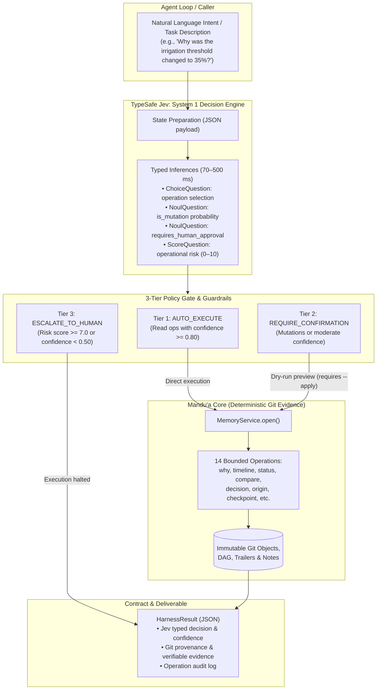
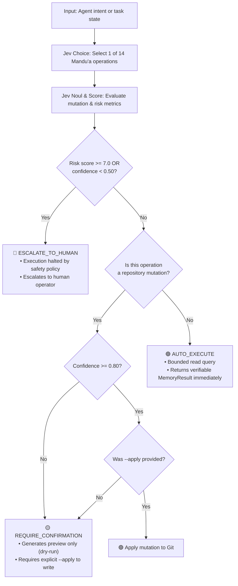
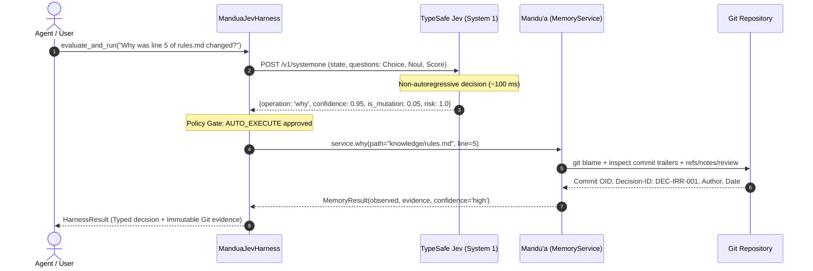
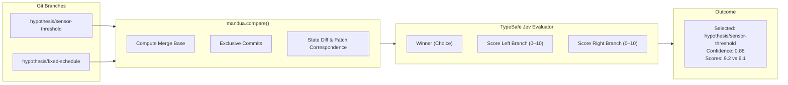

# Mandu'a — TypeSafe AI Jev Adapter Harness

This directory provides an adapter harness integrating **Mandu'a** (`mandua-memory`) with **Jev**, the System One model developed by [TypeSafe AI](https://typesafe.ai/).

---

## 1. End-to-End System Architecture



---

## 2. Decision Tree & Policy Enforcement

Jev does not generate arbitrary prose tokens; it evaluates typed questions with calibrated probability distributions and confidence values (`confidence`: 0.0 to 1.0):



---

## 3. Sequence Flow: Provenance Query (`why`)

How an automated agent reconstructs recorded Git provenance through Jev routing:



---

## 4. Sequence Flow: Safe Mutation (`checkpoint`)

Enforcing Mandu'a's two-phase preview and apply write guarantee:

```mermaid
sequenceDiagram
    autonumber
    actor Agent as Agent / User
    participant Harness as ManduaJevHarness
    participant Jev as TypeSafe Jev (System 1)
    participant Mandua as Mandu'a (MemoryService)

    Agent->>Harness: evaluate_and_run("Record verified irrigation threshold", apply=False)
    Harness->>Jev: Evaluate routing and risk questions
    Jev-->>Harness: {operation: 'checkpoint', is_mutation: 0.95, confidence: 0.78}
    
    Note over Harness: Policy Gate: REQUIRE_CONFIRMATION (Preview only)
    Harness->>Mandua: service.checkpoint(request, apply=False)
    Mandua-->>Harness: MemoryResult(applied=False, changes=[PlannedChange(...)])
    Harness-->>Agent: Returns preview; prompts for explicit apply
    
    Agent->>Harness: evaluate_and_run("Confirm", apply=True)
    Harness->>Mandua: service.checkpoint(request, apply=True)
    Mandua-->>Harness: MemoryResult(applied=True, new_oid="d3b073...")
    Harness-->>Agent: Semantic commit recorded cleanly
```

---

## 5. Hypothesis Comparison & Scoring (`compare`)

Comparing two divergent Git branches and using Jev as a quantitative evaluator:



---

## 6. Question Schema & Typed Outputs

| Question ID | Question Type | Input Mapping | Expected Typed Output |
| :--- | :--- | :--- | :--- |
| `operation` | `Choice` | Natural-language intent / program state | Exact Mandu'a operation name (`why`, `status`, `timeline`, etc.) |
| `is_mutation` | `Noul` | Write/commit indicators in intent | Mutation probability ($0.0 \dots 1.0$) |
| `requires_human_approval` | `Noul` | Risk patterns (`delete`, `force`, `rewrite`) | Critical risk probability ($0.0 \dots 1.0$) |
| `risk_score` | `Score` | Potential destructiveness of action | Quantitative scale ($0.0 \dots 10.0$) |

---

## 7. Python API Usage

```python
from pathlib import Path
from adapters.jev import ManduaJevHarness, TypeSafeJevClient

# Initialize client (uses TYPESAFE_API_KEY environment variable or offline mock)
client = TypeSafeJevClient()
harness = ManduaJevHarness(Path("/path/to/git-repo"), client=client)

# 1. Route intent and execute
result = harness.evaluate_and_run("Why was the irrigation threshold changed to 35%?")
print(result.route.operation)  # "why"
print(result.route.confidence)  # e.g. 0.95
print(result.memory_result.answer)  # Git provenance evidence from Mandu'a

# 2. Compare hypotheses and score candidates
evaluation = harness.compare_hypotheses_with_scoring(
    left="hypothesis/sensor-threshold",
    right="hypothesis/fixed-schedule",
    criteria="Water conservation with low sensor failure risk",
)
print(f"Winner: {evaluation['preferred_hypothesis']}")
print(f"Confidence: {evaluation['confidence']}")
```

---

## 8. CLI Usage

```console
# Query repository status or history through Jev routing
python3 -m adapters.jev --repo . "Show me the recent commit timeline for knowledge/rules.md" --path knowledge/rules.md

# Output in machine-readable JSON format
python3 -m adapters.jev --repo . "Check working tree status" --format json
```
