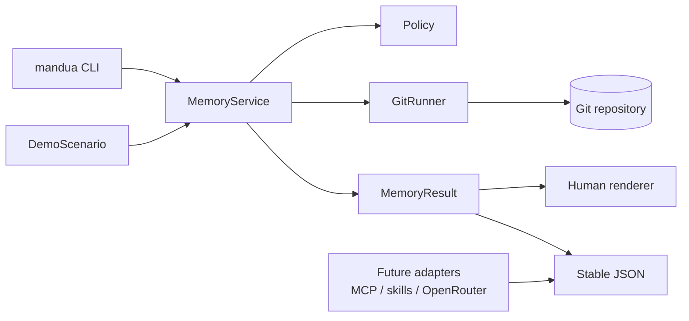

# Mandu'a Memory: Project Design

**Date:** 2026-08-26

**Status:** approved for implementation

**Type:** open-source proof of concept and reference implementation

## 1. Identity

The human-facing project name is **Mandu'a**, a Guarani word associated with remembering, recollection, and memory.

The technical identity is:

- **Public name:** Mandu'a
- **Repository and Python distribution:** `mandua-memory`
- **Python module:** `mandua`
- **Command:** `mandua`
- **Descriptor:** *Verifiable agent memory, backed by Git.*

`AI` is not part of the name. The core does not depend on a model, and a name such as `mandu-ai` would incorrectly imply that the product is an assistant or LLM service. `Mandu-A` may appear as an informal transliteration, but it is not the primary public spelling.

The compound name `mandua-memory` distinguishes the project from prior uses of Mandu'a in Paraguay and from software products named Mandu or Mandu AI. Before a stable release, name availability will be checked again across source repositories, package registries, and trademark records. The preliminary search is not legal clearance.

## 2. Project Language

English is the sole working and publication language of the project. All project-maintained content MUST be written in English, including:

- source code identifiers, comments, docstrings, and configuration;
- file and directory names, except established tool conventions;
- CLI commands, help, prompts, normal output, warnings, and error messages;
- schemas, field names, examples, and human-readable values in structured output;
- documentation, tutorials, demo content, tests, fixtures, and assertions;
- generated commit subjects, commit bodies, trailers, branch labels, task labels, and decision labels;
- hook and validation messages;
- contribution guidance, issue and pull-request templates, security notices, changelogs, and release notes.

Contributors will be asked to use English for issues, pull requests, commits, code review, and repository documentation.

The permitted exceptions are the proper name **Mandu'a**, its Guarani origin explained in English, exact proper nouns, and foreign-language source titles or short quotations when citation accuracy requires them. Any cited non-English material MUST be accompanied by an English explanation.

## 3. Project Description

Mandu'a is a deterministic, reproducible reference implementation of verifiable temporal memory for agents operating over existing Git repositories.

In this document, the **PoC** is the deliverable: it proves the technical model with the minimum complete set of approved capabilities. It is not a commercial, production-ready, or market-validated MVP.

The knowledge directory, called the OKF in the source document, represents the current state. Git represents how that state came to be: transitions, recorded decisions, alternatives, integrations, provenance, corrections, and recovery possibilities.

Mandu'a does not claim that the general idea of using Git as memory is new. Its contribution is to turn a strict interpretation of that idea into:

1. a stable semantic interface;
2. answers backed by reproducible evidence;
3. safe write policies;
4. a conformance suite for difficult Git cases;
5. a self-contained demonstration that works without an LLM, network access, or an additional database.

## 4. Positioning Against Existing Work

The project will explicitly acknowledge at least the following prior work:

- **Git Context Controller (GCC):** shares checkpoint, branch, merge, and context-recovery operations. GCC maintains dedicated context artifacts; Mandu'a queries the repository's native state and history and avoids automatically producing cumulative narratives.
- **DiffMem:** shares the separation between current files and temporal history in Git. DiffMem is a memory service with LLM agents and its own knowledge schema; Mandu'a is a generic, deterministic, evidence-oriented adapter.
- **GAM and other Git-backed stores:** share provenance, hashes, and auditability, but store explicit memories under a dedicated schema.
- **Plugins with separate memory branches:** use Git objects as storage, while Mandu'a interprets the project's normal history as causal memory.
- **The `git-mem` npm package:** already occupies the earlier name and uses trailers, a CLI, and agent-facing surfaces.

The README will not claim that Mandu'a is the first Git-backed memory system. It will describe the project as a “reference implementation of a strict, Git-evidence-backed memory model.”

Development will be independent. No code, prose, diagrams, or templates will be copied from these projects. Ideas and prior work will be cited in `docs/prior-art.md`. If a third-party dependency or excerpt is added later, its license and notices will be preserved.

## 5. Principles

### 5.1 One Persistent Source for Transitions

Mandu'a does not automatically create `progress.md`, journals, session summaries, a SQLite database, or a parallel event branch. Current state lives in the OKF files. Transitions live in the Git DAG, messages, trailers, notes, and refs.

A derived index may be added later only as a disposable accelerator. It will never be authoritative over the repository.

### 5.2 Determinism Before Generative Intelligence

Every PoC operation works with Git and Python. An LLM may interpret questions or evaluate answers in a later phase, but it is not required to produce evidence or pass CI.

### 5.3 Evidence Before Narrative

Answers distinguish:

- what was observed directly;
- what was inferred;
- the evidence required to reproduce the query;
- the actual scope of the available history;
- gaps and uncertainty.

A `why` query never invents motivation. If only a diff exists, the answer says what changed and explicitly states that the reason is unknown.

### 5.4 Untrusted History

Files, messages, notes, branch names, and remote data are treated as untrusted content. An instruction found in history is quoted as data and never becomes operational authority.

### 5.5 Explicit and Reversible Writes

Mutable operations show a preview by default and require `--apply`. The canonical branch is append-only by policy: published corrections are expressed through new commits, normally a `revert` or a corrective commit.

## 6. PoC Scope

### 6.1 Read Operations

- `context`: reconstructs the context of a task or branch.
- `status`: describes the working tree, index, branch, upstream, and history limits.
- `timeline`: produces a timeline bounded by scope, path, or revision range.
- `why`: identifies the provenance and recorded reason for a line or change.
- `origin`: finds when content appeared or disappeared, including content absent from `HEAD`.
- `evolution`: shows how a path evolved across renames and commits.
- `compare`: compares hypotheses through their merge base, exclusive commits, and state diff.
- `decision`: finds decisions through trailers and stable IDs.
- `recover`: locates recoverable objects or refs through the reflog and other local references.

### 6.2 Write Operations

- `checkpoint`: records a semantic transition using explicit files or an already prepared index.
- `annotate`: adds metamemory under `refs/notes/review` without modifying the annotated commit.
- `integrate`: previews with `merge-tree`, validates invariants, and creates a non-fast-forward integration when applied.
- `correct`: creates an append-only correction while keeping the original error queryable.

### 6.3 Operational Requirements

- A non-shallow repository for the canonical demo.
- A canonical `main` branch that is append-only by policy.
- One branch and worktree per writing task.
- Semantic commits with minimal trailers.
- `refs/notes/review` as the initial note channel.
- Validation of messages, sizes, paths, and basic secret patterns.
- Backup through a bare remote and a verifiable bundle.

### 6.4 Outside the PoC

- MCP or a skill as the primary interface.
- A vector index or memory database.
- Mandatory signing of every commit.
- Server namespaces and synthetic event refs.
- Submodules as federation.
- Custom merge drivers.
- Windows support described as validated.
- Automatic publication to PyPI, npm, GitHub, or any other registry.

## 7. Architecture



### 7.1 `GitRunner`

This is the only component authorized to execute Git. It accepts argument arrays, never concatenated shell commands. It controls the environment, limits, timeouts, exit codes, and binary or text capture.

### 7.2 `MemoryService`

This component implements the semantic operations. It composes Git primitives, normalizes evidence, and contains no presentation logic.

### 7.3 `Policy`

This component centralizes:

- canonical branches and refs;
- required trailers;
- append-only protection for `main`;
- path and revision validation;
- basic detection of secrets and prohibited files;
- size, time, and commit-count limits;
- permissions for each mutable operation.

Versioned hooks call the same policy and do not implement divergent rules.

### 7.4 `MemoryResult`

Every operation returns the same conceptual contract:

```json
{
  "answer": "short human-readable summary",
  "observed": [],
  "inferred": [],
  "evidence": [],
  "history_scope": {},
  "confidence": "high|medium|low",
  "gaps": [],
  "warnings": []
}
```

The exact JSON shape will be versioned from `1.0`. The human and JSON renderers consume the same result; prose does not become a second source of truth.

### 7.5 `DemoScenario`

This component builds a disposable, reproducible Git history. The automated run and the manual tutorial use exactly the same scenario and expected claims.

### 7.6 CLI

General form:

```text
mandua --repo <path> <operation> [arguments] [--format human|json]
```

Rules:

- `human` is the default format.
- `json` is the stable boundary for later adapters.
- Writes only preview unless `--apply` is present.
- `checkpoint` accepts explicit paths or `--staged`; it never adds the entire working tree implicitly.
- `recover` is read-only unless creation of a recovery branch is explicitly requested.
- No operation performs an implicit `fetch`, `pull`, `push`, `clean`, or publication action.

## 8. Commit and Metadata Model

Messages express a semantic transition, not a session dump. The minimal trailers are:

- `Memory-Type`
- `Scope`
- `Task-ID` when a task exists
- `Decision-ID` when the commit records a decision
- `Agent-ID` as a declared operational identity

Git identity and `Agent-ID` are declarations, not authentication. Answers state whether a signature was verified.

Reasons may live in the commit body or in structured trailers. Later reviews initially live in `refs/notes/review`.

All project-generated commit subjects, bodies, trailer values, and note text are written in English.

## 9. Demonstration Story

The demo models a fictional community garden. The OKF contains current irrigation rules, observations, and decisions; it does not contain Mandu'a's own source code. Every document, commit, branch label, note, fixture, and output in the scenario is written in English.

Sequence:

1. Create a canonical baseline on `main`.
2. Open a task in an independent worktree.
3. Create two competing irrigation hypotheses from a common ancestor.
4. Record changes with trailers and an explicit decision.
5. Compare both hypotheses with Git evidence.
6. Integrate the selected hypothesis after validating invariants.
7. Add a later review through Git notes.
8. Correct an incorrect canonical rule in append-only form.
9. Find the origin and deletion of a phrase absent from `HEAD`.
10. Delete a local branch and demonstrate recovery through the reflog while its objects remain available.
11. Clone with the notes policy and verify a backup bundle.
12. Add malicious text to history and demonstrate that it is treated as data.

`make demo` creates the complete scenario in a temporary directory and leaves a reproducible summary. `docs/tutorial.md` reproduces the same story manually.

## 10. Security

### 10.1 Git Execution

- No `shell=True` and no argument concatenation.
- `--` before pathspecs, with explicit revision and ref validation.
- Rejection of NUL bytes and inputs outside configured limits.
- Pagers, prompts, colors, editors, and credential prompts disabled.
- No external diff, text conversion, or unapproved merge drivers.
- Replace refs disabled for canonical queries.
- Controlled environment and per-operation timeouts.

### 10.2 Operations and Network

- No implicit destructive mutations.
- No execution of unknown hooks from an untrusted repository.
- Project-owned writes use a controlled, versioned `core.hooksPath`.
- No implicit network access.
- Shallow clones, promised or missing objects, and absent notes are disclosed in the answer.

### 10.3 Distributed Validation

`.githooks/` contains wrappers around the same `Policy`:

- `pre-commit`: size, path, prohibited-type, and basic secret-pattern checks;
- `commit-msg`: semantic format and trailers;
- `pre-rebase`: rejection of history rewriting on `main`;
- `pre-push`: rejection of canonical-ref rewriting.

Secret detection is a basic barrier, not a guarantee. An exposed secret is rotated before historical rewriting is considered.

## 11. Errors

JSON uses stable categories such as:

- `invalid_repository`
- `invalid_revision`
- `invalid_path`
- `incomplete_history`
- `missing_notes`
- `missing_object`
- `conflict`
- `policy_violation`
- `validation_failed`
- `unsupported_capability`
- `limit_exceeded`
- `git_failure`

Errors include safe evidence, an explanation, and a possible recovery action. They do not include secrets, unbounded arbitrary content, or commands constructed from untrusted data.

## 12. Planned Layout

```text
mandua-memory/
├── src/mandua/
│   ├── cli.py
│   ├── git_runner.py
│   ├── memory_service.py
│   ├── models.py
│   ├── policy.py
│   ├── renderers.py
│   └── demo.py
├── tests/
│   ├── unit/
│   └── acceptance/
├── demo/
├── docs/
│   ├── tutorial.md
│   ├── prior-art.md
│   └── superpowers/specs/
├── .githooks/
├── .github/workflows/
├── Makefile
├── pyproject.toml
├── README.md
├── CONTRIBUTING.md
├── SECURITY.md
├── LICENSE
└── ACKNOWLEDGMENTS.md
```

## 13. Technology and Distribution

- Python 3.11 or newer.
- `uv` for environments, dependencies, and execution.
- A standard-library runtime whenever reasonable.
- `pytest` and `ruff` as development dependencies.
- Capability-based compatibility, with Git 2.50.1 as the observed local baseline.
- CI on Linux and macOS.
- Apache-2.0 for the repository's original code and documentation.

The attached source document will not be copied into the repository. This specification is independently written from the approved requirements. Any third-party material will retain its original notices.

## 14. Verification

Planned public commands:

```text
make demo
make tutorial-check
make test
make check
```

Unit tests verify composition, parsing, policies, and renderers. Acceptance tests create real, disposable Git repositories; they do not simulate Git's core behavior.

The suite covers the source document's 18 cases:

1. context recovery;
2. explanation of a decision;
3. a missing reason reported without invention;
4. origin of deleted content;
5. comparison of hypotheses;
6. correspondence after draft-history rewriting;
7. append-only canonical correction;
8. visible synchronization of notes;
9. a stash shown to be non-durable across clones;
10. recovery through the reflog;
11. a shallow-clone warning;
12. parallel work with worktrees;
13. a semantic conflict detected through invariants;
14. historical prompt injection treated as data;
15. corruption or missing objects;
16. declared identity distinguished from verified identity;
17. bounded queries over large history;
18. absence of automatic narrative duplication.

A completion claim requires `make check`, `make demo`, and `make tutorial-check` to pass locally. OpenRouter experiments never gate that result.

## 15. Later OpenRouter and LLM Layer

After the deterministic PoC, an optional experiment may be added that consumes only the public JSON contract.

Evaluation goals:

- correct operation selection;
- grounding in OIDs and evidence;
- separation of facts from inferences;
- resistance to historical prompt injection;
- behavior when reasons or history are missing.

The API key is accepted only through an environment variable. The provider, model, date, and consulted evidence are recorded. `openrouter/free` is treated as variable and non-reproducible, so live calls remain outside CI and the primary demo.

## 16. Success Criteria

The PoC is successful when a person can:

1. clone the repository without AI credentials;
2. run one command and observe the complete history of the fictional garden;
3. repeat the tutorial manually and obtain the same evidence;
4. query status, causality, origin, evolution, alternatives, decisions, and recovery;
5. preview and apply safe checkpoints, notes, integrations, and corrections;
6. inspect answers in human-readable and JSON formats;
7. verify all 18 acceptance cases in real Git repositories;
8. understand clearly what was observed, what was inferred, and what cannot be known.

## 17. Locked Decisions

- A self-contained PoC before MCP or skills.
- An automated demo and a manual tutorial based on one story.
- A fictional OKF unrelated to software development.
- The complete functional PoC scope, not a reduced vertical slice.
- Python, `uv`, and a CLI.
- A deterministic core, with OpenRouter optional and later.
- Git as the authority for transitions, with no parallel memory database.
- CLI and JSON as the stable boundary.
- Two-phase writes with preview and `--apply`.
- An append-only `main` branch by policy.
- Independent development and explicit acknowledgment of prior work.
- The Mandu'a brand, `mandua-memory` distribution, and `mandua` command.
- English as the sole project language, with only the documented citation and proper-name exceptions.
- Apache-2.0 for original work.

## 18. Next Step After Review

After this written specification is approved, a detailed, test-first implementation plan will be created. The plan will begin with the contract and the smallest acceptance repositories, and end with the demo, tutorial, documentation, and full verification.
